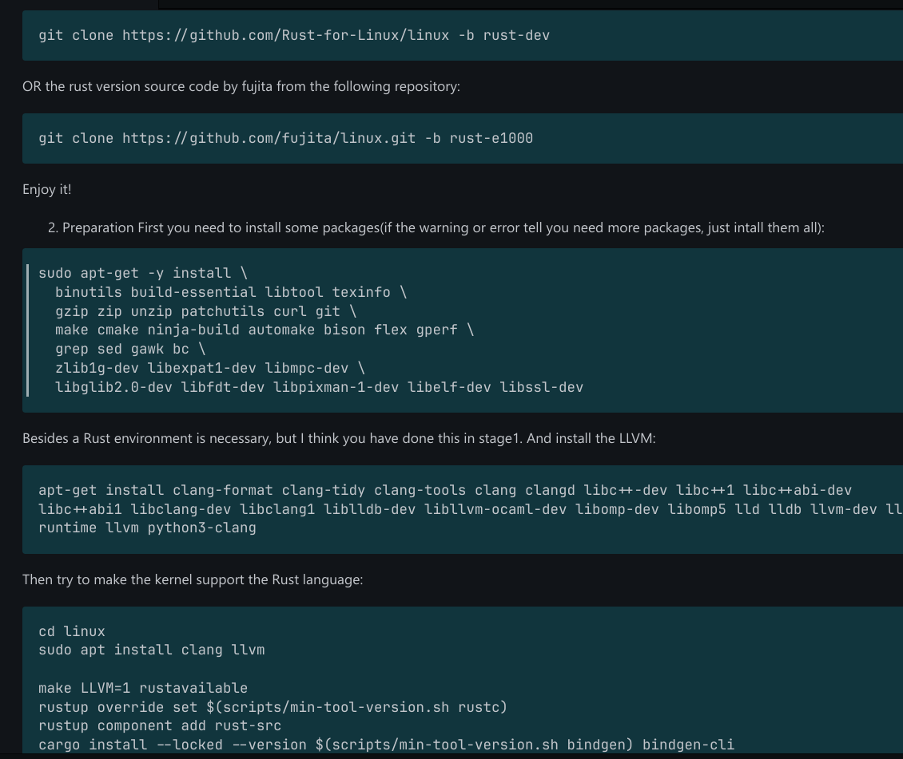
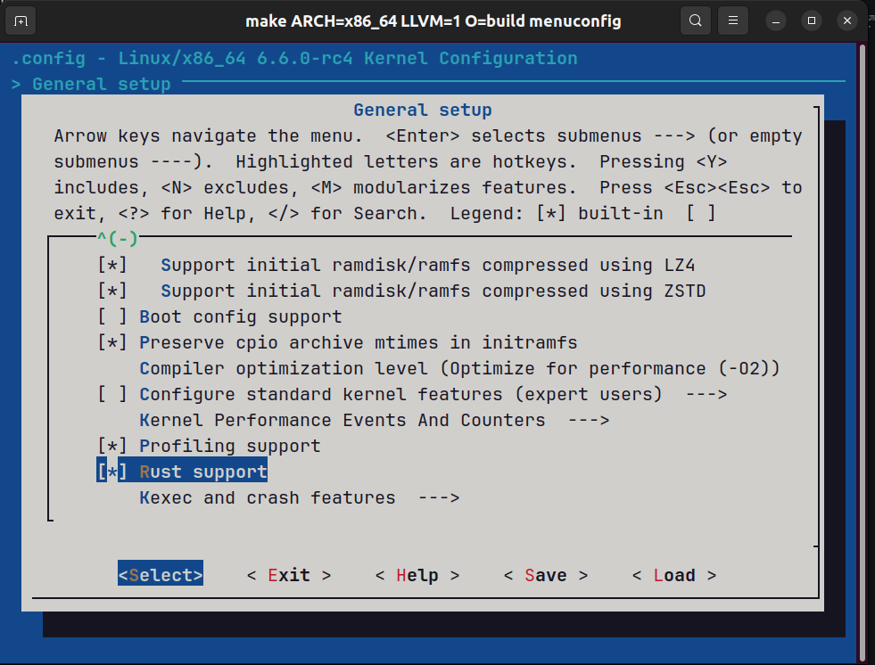
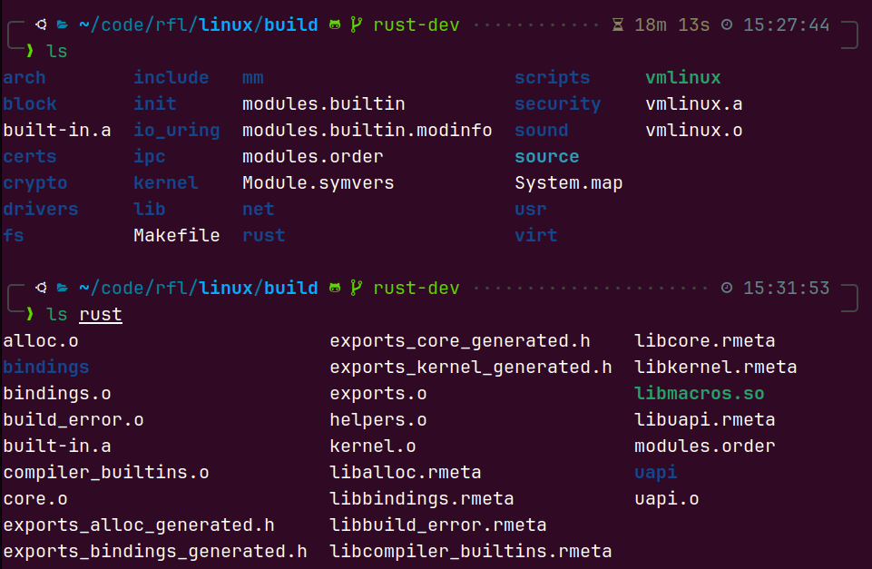
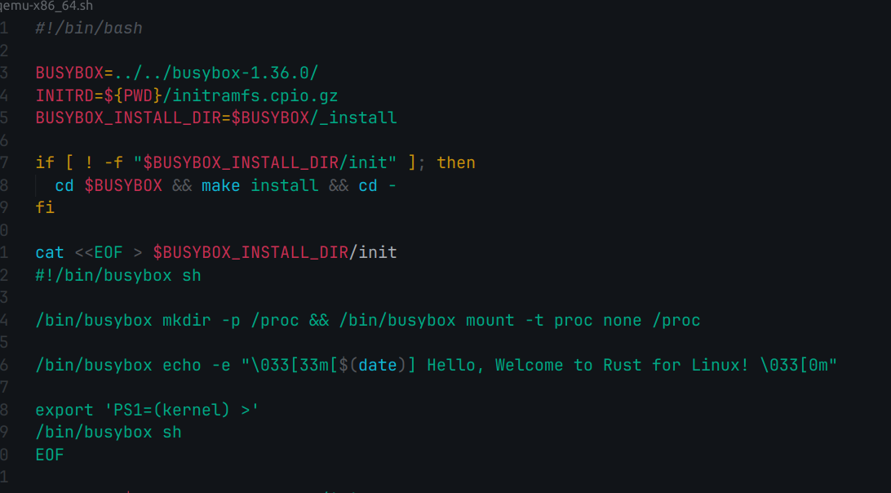
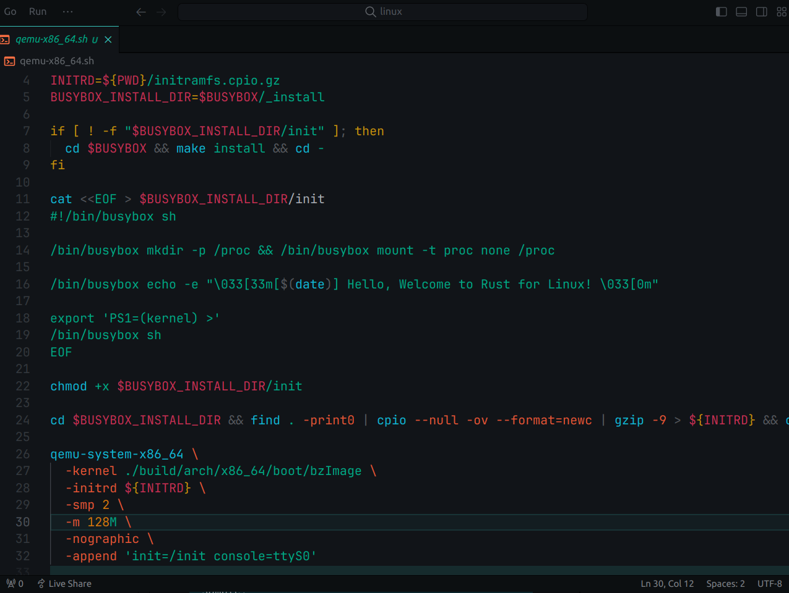
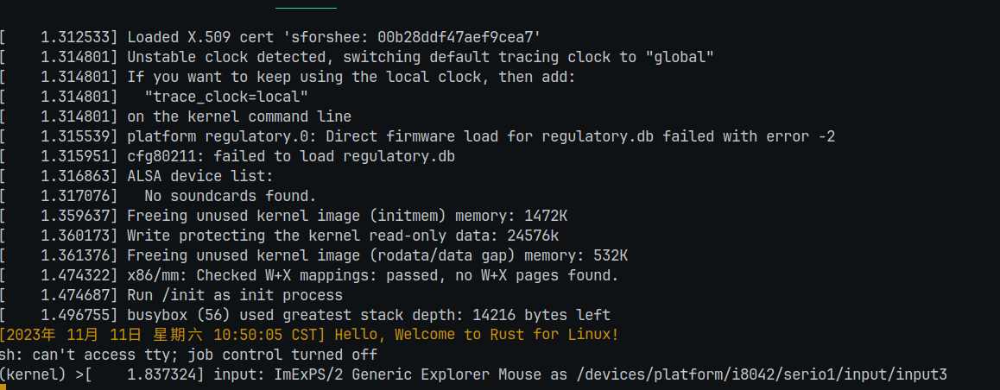
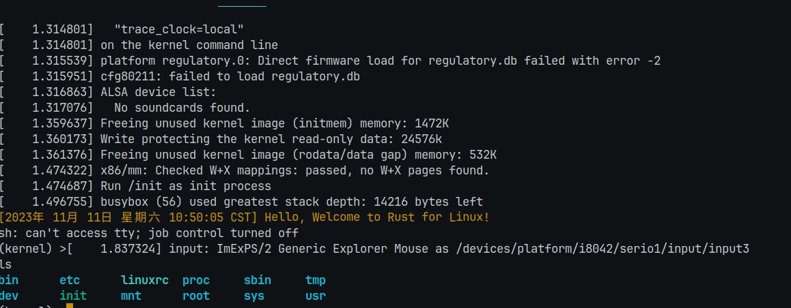

首先按照教程，clone下载rust for linux驱动，值得注意的是，这个教程里启用support the rust language的方法适用于仓库1,如果是使用的仓库2的话，可以使用改变最后一行将bindgen-cli改为bindgen --force, (这里折腾了一上午摸索出来了)。


下载完后使用makeflie进行构建,我这里使用的是x86_64
```
make ARCH=x86_64 LLVM=1 O=build defconfig

make ARCH=x86_64 LLVM=1 O=build menuconfig

```
选者general setup 勾选 rust support 


进入build目录 执行：

make ARCH=x86_64 LLVM=1 -j8


构建完后build 里面的目录


编写的一个shell用于快速qemu启动



成功运行


