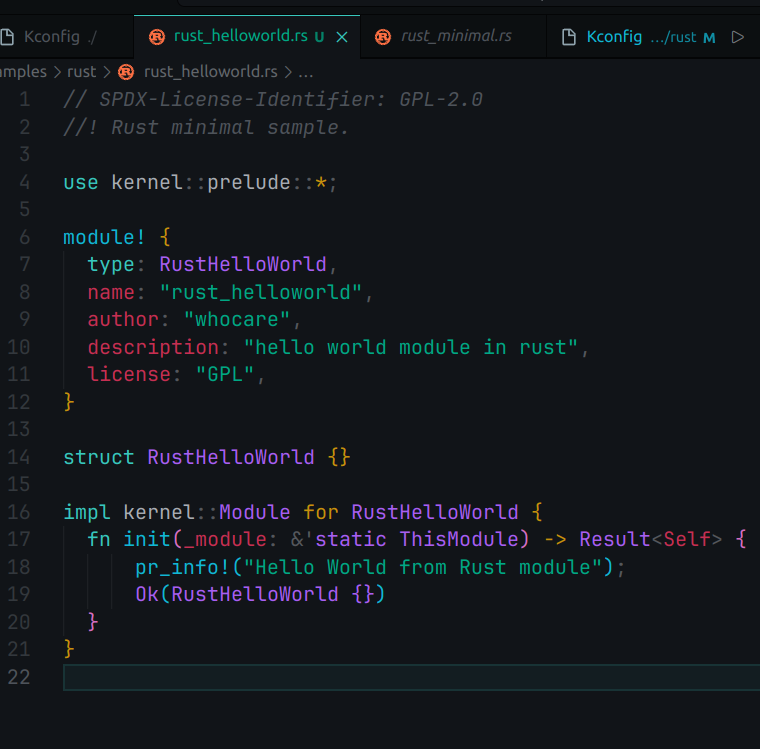
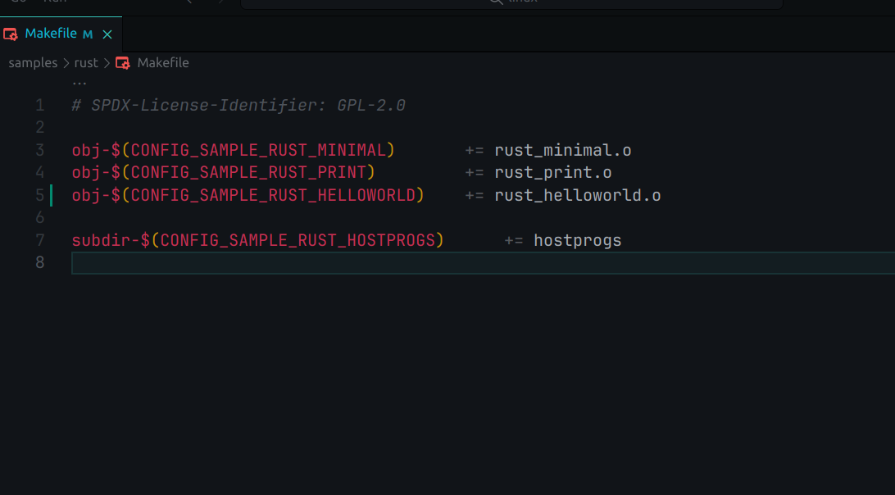
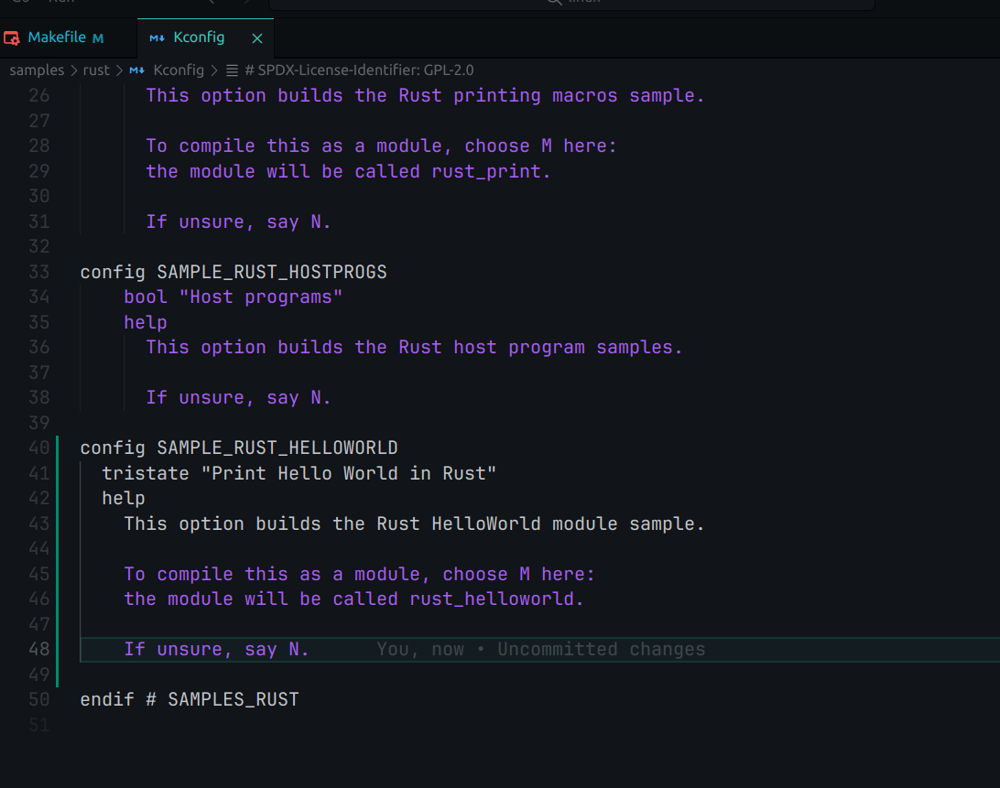
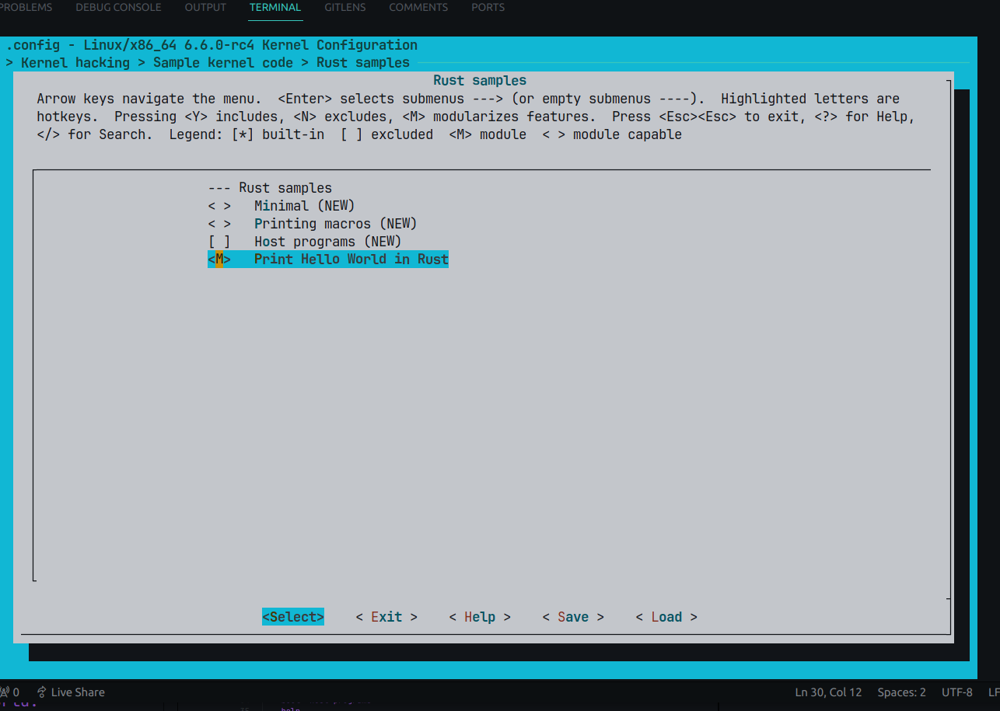
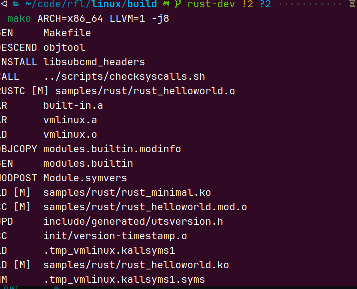
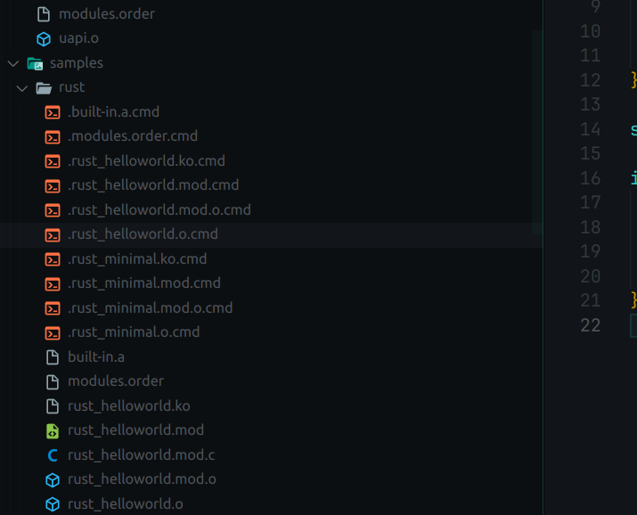
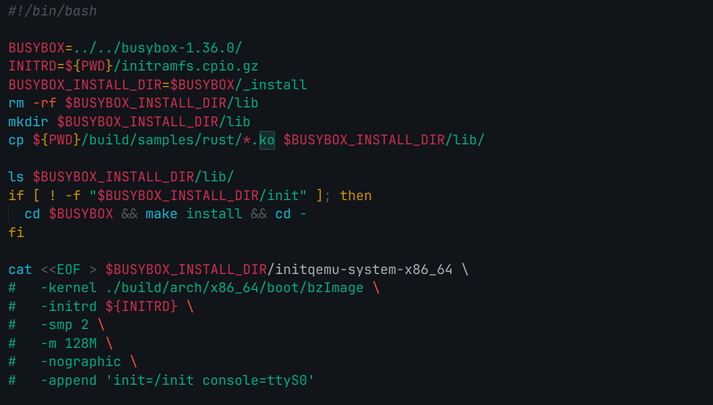
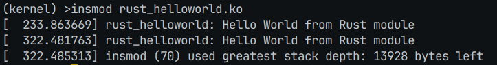
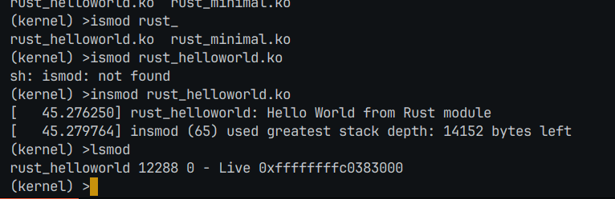

在linux/sample/rust/ 下编写rust_helloworld.rs

在同级的makefile里面加上
obj-$(CONFIG_SAMPLE_RUST_HELLOWORLD)    += rust_helloworld.o

同时在kconfig里面添加HelloWorld的配置信息

在练习1基础上，添加 rust_helloworld 模块配置

make ARCH=arm64 LLVM=1 O=build menuconfig

勾选module

进入build 进行make

可以看到编译后生成了helloworld.ko

配置一下练习1的脚本，将ko文件放入busybox里面

手动insmod一下 /lib/rust_helloworld.ko

